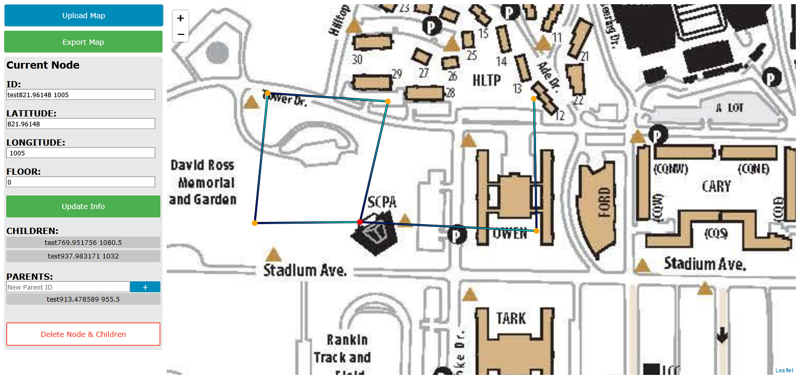
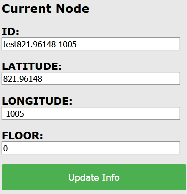
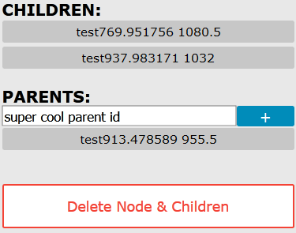
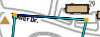
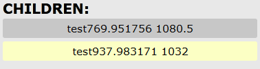

# Purdue-Buildings
Purdue Hello World Hackathon Project

Provides navigation inside buildings using pathfinding

## Map View
Input room number at top search bar to find room

Input start and ending room number at bottom to find shortest path

## Map Data Generator
### Sample View

### Basic Instructions

**UPLOAD** an image file (png, jpg, etc.) to start

**CLICK EXPORT** to prompt a download for a JSON file containing the mapped nodes

**RIGHT CLICK** to place new nodes

**LEFT CLICK** to select node to branch from

**HOLD LEFT CLICK** to drag node to new position

**CLICK UPDATE INFO** to save any changes in the **TEXT BOXES**

### Loops
Create a loop by adding a new parent to an existing node. It is strongly suggested to add a parent to the node **LOWER** in the tree. (This will prevent unexpected problems when deleting.)

### Deleting Nodes
Removing a node also removes **ALL** its children. Be careful when deleting any node and **ESPECIALLY** when deleting nodes in a loop. 

Click through all of a node's children (and their children's children... etc) through the sidebar to check what you are deleting!

### Quality of Life

Here are some visual features to help users understand maps at a glance.

#### Connections between nodes are a gradient. Parent side is darker.

#### Select a node's parents/children directly through the side bar

